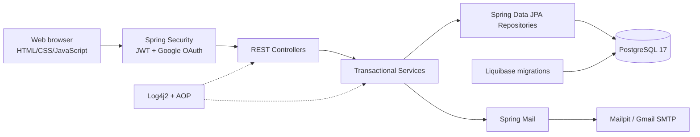

# SparkMinds Library

Ứng dụng quản lý thư viện hoàn chỉnh được xây dựng bằng Spring Boot, Spring
Data JPA, Spring Security, JWT và PostgreSQL. Dự án cung cấp cả REST API và
giao diện web responsive dành cho quản trị viên và thành viên thư viện.

Ứng dụng hỗ trợ quản lý sách, thành viên, mượn/trả sách, xác minh email,
khôi phục mật khẩu, đăng nhập Google, refresh token, maintenance mode,
import CSV, lưu sách yêu thích và chuyển đổi đầy đủ giữa tiếng Việt/tiếng Anh.

Repository: [github.com/danhhuit/spark_minds](https://github.com/danhhuit/spark_minds)

## Mục lục

- [Tính năng chính](#tính-năng-chính)
- [Phân quyền](#phân-quyền)
- [Công nghệ sử dụng](#công-nghệ-sử-dụng)
- [Kiến trúc ứng dụng](#kiến-trúc-ứng-dụng)
- [Cấu trúc dự án](#cấu-trúc-dự-án)
- [Yêu cầu môi trường](#yêu-cầu-môi-trường)
- [Chạy nhanh trên Windows PowerShell](#chạy-nhanh-trên-windows-powershell)
- [Chạy trên Git Bash, Linux hoặc macOS](#chạy-trên-git-bash-linux-hoặc-macos)
- [Biến môi trường](#biến-môi-trường)
- [Cấu hình gửi email](#cấu-hình-gửi-email)
- [Cấu hình Google OAuth](#cấu-hình-google-oauth)
- [Địa chỉ sau khi khởi động](#địa-chỉ-sau-khi-khởi-động)
- [Tài khoản mặc định](#tài-khoản-mặc-định)
- [Tổng quan REST API](#tổng-quan-rest-api)
- [Database và Liquibase](#database-và-liquibase)
- [Dữ liệu 50 sách và ảnh bìa](#dữ-liệu-50-sách-và-ảnh-bìa)
- [Import sách bằng CSV](#import-sách-bằng-csv)
- [Chuyển ngữ tiếng Việt và tiếng Anh](#chuyển-ngữ-tiếng-việt-và-tiếng-anh)
- [Logging](#logging)
- [Build và chạy file JAR](#build-và-chạy-file-jar)
- [Chạy test](#chạy-test)
- [Xử lý lỗi thường gặp](#xử-lý-lỗi-thường-gặp)
- [Lưu ý bảo mật](#lưu-ý-bảo-mật)
- [Tài liệu bổ sung](#tài-liệu-bổ-sung)

## Tính năng chính

### Xác thực và tài khoản

- Đăng nhập bằng username hoặc email và mật khẩu.
- Đăng nhập/đăng ký bằng Google OAuth 2.0/OpenID Connect.
- Đăng xuất và thu hồi cả access token lẫn refresh token.
- Tự động refresh access token khi API trả HTTP 401.
- Đăng ký thành viên bằng email và mật khẩu.
- Gửi liên kết xác minh email sau khi đăng ký.
- Chỉ cho phép đăng nhập sau khi email đã được xác minh.
- Quên mật khẩu và gửi liên kết đặt lại mật khẩu qua email.
- Đổi mật khẩu sau khi kiểm tra mật khẩu hiện tại.
- Đổi email bằng mã xác minh 6 chữ số gửi tới email mới.
- Cập nhật username, họ tên, ngày sinh, số điện thoại và địa chỉ.
- Nhắc người dùng cập nhật số điện thoại/ngày sinh nếu hồ sơ chưa đầy đủ.

### Quản lý sách

- Hiển thị danh mục sách có phân trang.
- Search bằng Spring Data JPA Specification.
- Tìm theo từ khóa, ISBN, tên sách, tác giả, nhà xuất bản, danh mục,
  ngày xuất bản, trạng thái và tồn kho.
- Mỗi trang tối đa 10 bản ghi.
- Thêm, sửa và ngừng hoạt động sách.
- Validate dữ liệu create/update.
- Không cho giảm tổng số lượng thấp hơn số sách đang được mượn.
- Import nhiều sách từ file CSV trong một transaction.
- File CSV tối đa 5 MB và chỉ hỗ trợ phần mở rộng `.csv`.
- Trang chi tiết sách có mô tả, thông tin xuất bản, nút lưu và nút mượn.
- Hỗ trợ ảnh bìa `.jpg`, `.jpeg`, `.png`, `.webp`.
- Có sẵn 50 sách mẫu bằng Liquibase.

### Quản lý thành viên

- Search thành viên bằng JPA Specification với nhiều điều kiện:
  - từ khóa tổng hợp;
  - họ tên;
  - email;
  - mã thành viên;
  - ID/tên sách đã mượn;
  - khoảng ngày sinh;
  - trạng thái hoạt động;
  - trạng thái xác minh email;
  - trạng thái khóa;
  - role.
- Tạo thành viên mới.
- Cập nhật hồ sơ và trạng thái tài khoản.
- Vô hiệu hóa thành viên.
- Không hiển thị mật khẩu rõ; chỉ hiển thị trạng thái đã thiết lập vì password
  được lưu dưới dạng BCrypt hash.

### Mượn và trả sách

- Kiểm tra thành viên đang hoạt động, không bị khóa và đã xác minh email.
- Kiểm tra sách đang hoạt động và còn tồn kho.
- Mỗi thành viên chỉ có thể có một lượt mượn đang hoạt động tại một thời điểm.
- Lock dữ liệu khi cập nhật để hạn chế sai lệch tồn kho.
- Tự động tính hạn trả theo cấu hình số ngày mượn.
- Trả sách và cộng lại số lượng tồn kho trong cùng transaction.
- Lưu ngày mượn, hạn trả và ngày trả đầy đủ đến giờ, phút, giây.
- Thành viên xem lịch sử của mình; admin xem toàn bộ lịch sử.

### Quản trị hệ thống

- Xem cấu hình hệ thống hiện tại.
- Bật/tắt maintenance mode.
- Cập nhật thông báo bảo trì.
- Khi maintenance được bật, các API nghiệp vụ trả HTTP 503.
- API đăng nhập và API cấu hình vẫn hoạt động để admin có thể đăng nhập và
  tắt bảo trì.
- Log request/response metadata ra console và rolling log file.
- AOP log controller call, return và exception.
- Swagger/OpenAPI cho toàn bộ REST API.

### Giao diện

- Giao diện responsive chạy cùng Spring Boot, không cần frontend server riêng.
- Chế độ dành riêng cho ADMIN và USER.
- Chuyển đổi tiếng Việt/tiếng Anh không cần reload.
- Dịch cả nội dung động, modal, toast, validation backend, placeholder,
  tooltip và trạng thái.
- Toggle mắt cho các ô password.
- Pagination dạng số `1, 2, 3, 4, 5...`.
- Kệ sách có nút điều hướng trái/phải.

## Phân quyền

| Chức năng | ADMIN | USER |
|---|:---:|:---:|
| Đăng nhập, logout, refresh token | Có | Có |
| Xem/search/chi tiết sách | Có | Có |
| Thêm, sửa, ngừng hoạt động sách | Có | Không |
| Import CSV | Có | Không |
| Quản lý thành viên | Có | Không |
| Xem toàn bộ lịch sử mượn/trả | Có | Không |
| Mượn sách | Không hiện trên giao diện | Có |
| Trả sách của chính mình | Có thể hỗ trợ | Có |
| Lưu sách | Không hiện trên giao diện | Có |
| Cập nhật hồ sơ | Có | Có |
| Đổi mật khẩu/email | Có | Có |
| Bật/tắt maintenance mode | Có | Không |

> Lưu ý: các endpoint `/api/admin/**` được khóa bằng `ROLE_ADMIN`. Một số API
> mượn/lưu/profile hiện yêu cầu authenticated nhưng chưa gắn riêng
> `ROLE_USER`; xem phần giới hạn trong
> [báo cáo kiểm toán](docs/REQUIREMENTS_AUDIT.md).

## Công nghệ sử dụng

| Nhóm | Công nghệ |
|---|---|
| Ngôn ngữ | Java 21 |
| Framework | Spring Boot 4.1.1 |
| REST/Web | Spring Web MVC |
| ORM | Spring Data JPA, Hibernate |
| Database | PostgreSQL 17 |
| Migration | Liquibase, 16 changeset |
| Security | Spring Security, OAuth2 Resource Server |
| Token | JWT access token, rotating refresh token |
| Social login | Spring OAuth2 Client, Google OpenID Connect |
| Validation | Jakarta Bean Validation, custom password validator |
| Email | Spring Mail, Mailpit hoặc Gmail SMTP |
| CSV | Apache Commons CSV 1.14.1 |
| Logging | Log4j2, RollingFile, Spring AOP |
| Boilerplate | Lombok |
| API docs | Springdoc OpenAPI 3.0.3, Swagger UI |
| Test | JUnit 5, MockMvc, Testcontainers 1.21.4 |
| Hạ tầng local | Docker Compose |
| Frontend | HTML5, CSS3, JavaScript thuần |

Không cần cài Maven toàn cục vì repository đã có Maven Wrapper:
`mvnw` và `mvnw.cmd`.

## Kiến trúc ứng dụng



Luồng code chính:

```text
HTTP request
  -> Security/Maintenance/Logging filters
  -> Controller
  -> DTO validation
  -> Transactional service
  -> Repository/JPA
  -> PostgreSQL
  -> Mapper/response DTO
  -> Global exception handling hoặc HTTP response
```

Quan hệ Hibernate tiêu biểu:

- One-to-One: `UserAccount` ↔ `MemberProfile`.
- One-to-Many: member ↔ borrowings, book ↔ borrowings, category ↔ books.
- Many-to-Many: user ↔ roles, book ↔ authors.
- Many-to-One: borrowing → member/book và các bảng token → user.

## Cấu trúc dự án

```text
spark_minds/
├── compose.yaml
├── pom.xml
├── mvnw
├── mvnw.cmd
├── books-import.csv
├── books-import-invalid.csv
├── docs/
│   ├── GOOGLE_EMAIL_AUTH_SETUP.md
│   ├── MULTI_PROVIDER_AUTH_SETUP.md
│   └── REQUIREMENTS_AUDIT.md
└── src/
    ├── main/
    │   ├── java/com/sparkminds/library/
    │   │   ├── auth/               # Login, register, token, Google OAuth
    │   │   ├── book/               # Sách, category, author, CSV
    │   │   ├── borrowing/          # Mượn/trả sách
    │   │   ├── common/             # API response, exception, logging
    │   │   ├── config/             # Admin seed, JWT, OpenAPI
    │   │   ├── mail/               # Gửi email
    │   │   ├── member/             # Thành viên và role
    │   │   ├── profile/            # Hồ sơ cá nhân
    │   │   ├── savedbook/          # Sách đã lưu
    │   │   ├── security/           # Spring Security/JWT
    │   │   └── systemconfig/       # Maintenance mode
    │   └── resources/
    │       ├── application.yml
    │       ├── log4j2-spring.xml
    │       ├── db/changelog/        # 16 Liquibase changeset
    │       └── static/              # Giao diện web và ảnh bìa
    └── test/
        ├── java/                    # Integration tests
        └── resources/application-test.yml
```

## Yêu cầu môi trường

### Bắt buộc

- Java Development Kit 21 trở lên.
- Docker Desktop hoặc Docker Engine có Docker Compose.
- Git.
- Cổng local chưa bị ứng dụng khác sử dụng:
  - `8080`: Spring Boot;
  - `5433`: PostgreSQL;
  - `1025`: Mailpit SMTP;
  - `8025`: Mailpit web UI.

### Kiểm tra môi trường

PowerShell:

```powershell
java -version
docker --version
docker compose version
git --version
```

Java 21, 22, 23 hoặc 25 đều có thể chạy bytecode target Java 21, nhưng Java 21
LTS là lựa chọn khuyến nghị.

## Chạy nhanh trên Windows PowerShell

### Bước 1 — Clone repository

```powershell
git clone https://github.com/danhhuit/spark_minds.git
cd spark_minds
```

Nếu source đã có sẵn:

```powershell
cd D:\sparkminds\src
```

### Bước 2 — Khởi động PostgreSQL và Mailpit

```powershell
docker compose up -d
docker compose ps
```

Kết quả mong đợi: service `postgres` và `mailpit` ở trạng thái running.

### Bước 3 — Tạo JWT secret

JWT secret là biến bắt buộc. Đoạn sau sinh ngẫu nhiên 32 byte và mã hóa Base64:

```powershell
$jwtBytes = New-Object byte[] 32
$jwtRandom = [Security.Cryptography.RandomNumberGenerator]::Create()
$jwtRandom.GetBytes($jwtBytes)
$jwtRandom.Dispose()
$env:JWT_SECRET = [Convert]::ToBase64String($jwtBytes)
```

Kiểm tra biến đã tồn tại mà không in secret ra màn hình:

```powershell
if ($env:JWT_SECRET) { "JWT_SECRET đã được thiết lập" }
```

Biến `$env:...` chỉ tồn tại trong cửa sổ PowerShell hiện tại. Khi mở terminal
mới, cần set lại.

### Bước 4 — Cấu hình Google

Spring OAuth Client hiện yêu cầu hai biến Google không được để trống.

Nếu chưa sử dụng đăng nhập Google, đặt giá trị local giả để ứng dụng khởi động:

```powershell
$env:GOOGLE_CLIENT_ID = "google-disabled-local"
$env:GOOGLE_CLIENT_SECRET = "google-disabled-local"
```

Ứng dụng vẫn chạy email/password nhưng nút Google sẽ không đăng nhập được.

Nếu đã tạo Google OAuth Client:

```powershell
$env:GOOGLE_CLIENT_ID = "YOUR_CLIENT_ID.apps.googleusercontent.com"
$env:GOOGLE_CLIENT_SECRET = "YOUR_GOOGLE_CLIENT_SECRET"
```

Không commit Client Secret lên GitHub.

### Bước 5 — Chạy Spring Boot

```powershell
.\mvnw.cmd spring-boot:run
```

Chờ tới khi log xuất hiện:

```text
Started LibraryManagementApplication
```

Sau đó mở [http://localhost:8080](http://localhost:8080).

### Bước 6 — Đăng nhập

```text
Username: admin
Password: admin
```

### Dừng hoặc khởi động lại

Nhấn `Ctrl + C` trong terminal đang chạy Spring Boot. Sau đó có thể chạy lại:

```powershell
.\mvnw.cmd spring-boot:run
```

Khi không còn cần database và Mailpit:

```powershell
docker compose down
```

Lệnh này giữ lại dữ liệu PostgreSQL trong Docker volume.

## Chạy trên Git Bash, Linux hoặc macOS

```bash
git clone https://github.com/danhhuit/spark_minds.git
cd spark_minds
docker compose up -d

export JWT_SECRET="$(openssl rand -base64 32)"

# Dùng giá trị giả nếu chưa setup Google:
export GOOGLE_CLIENT_ID="google-disabled-local"
export GOOGLE_CLIENT_SECRET="google-disabled-local"

chmod +x mvnw
./mvnw spring-boot:run
```

Nếu dùng Google thật, thay hai giá trị giả bằng Client ID và Client Secret.

## Biến môi trường

| Biến | Bắt buộc | Mặc định | Ý nghĩa |
|---|:---:|---|---|
| `JWT_SECRET` | **Có** | Không có | Base64 secret, giải mã tối thiểu 32 byte |
| `GOOGLE_CLIENT_ID` | **Có để app khởi động** | Chuỗi rỗng | Google OAuth Client ID |
| `GOOGLE_CLIENT_SECRET` | **Có để app khởi động** | Chuỗi rỗng | Google OAuth Client Secret |
| `DB_URL` | Không | `jdbc:postgresql://127.0.0.1:5433/library_db` | JDBC URL |
| `DB_USERNAME` | Không | `library_user` | Database username |
| `DB_PASSWORD` | Không | `library_password` | Database password |
| `MAIL_HOST` | Không | `localhost` | SMTP host |
| `MAIL_PORT` | Không | `1025` | SMTP port |
| `MAIL_USERNAME` | Tùy SMTP | Trống | SMTP username |
| `MAIL_PASSWORD` | Tùy SMTP | Trống | SMTP/App Password |
| `MAIL_FROM` | Không | `no-reply@library.local` | Địa chỉ From |
| `MAIL_SMTP_AUTH` | Không | `false` | Bật SMTP authentication |
| `MAIL_STARTTLS_ENABLE` | Không | `false` | Bật STARTTLS |
| `MAIL_STARTTLS_REQUIRED` | Không | `false` | Bắt buộc STARTTLS |
| `FRONTEND_URL` | Không | `http://localhost:8080` | URL dùng trong link frontend |
| `BACKEND_URL` | Không | `http://localhost:8080` | URL callback/link backend |
| `DEFAULT_LOAN_DAYS` | Không | `14` | Số ngày mượn mặc định |
| `ADMIN_USERNAME` | Không | `admin` | Username admin lần khởi tạo đầu |
| `ADMIN_PASSWORD` | Không | `admin` | Password admin lần khởi tạo đầu |
| `ADMIN_EMAIL` | Không | `admin@library.local` | Email admin lần khởi tạo đầu |

### Lưu ý về `.env`

File `.env` đã được đưa vào `.gitignore`, nhưng Spring Boot không tự động đọc
file `.env` nếu không có công cụ bổ sung. Cách chắc chắn nhất là set `$env:...`
trong đúng terminal dùng để chạy Maven/JAR.

Không dùng dấu gạch chéo để escape email trong PowerShell:

```powershell
# Đúng
$env:MAIL_USERNAME = "name@gmail.com"

# Sai
$env:MAIL_USERNAME = "name\@gmail.com"
```

## Cấu hình gửi email

### Phương án 1 — Mailpit cho local, hoàn toàn miễn phí

`compose.yaml` đã cấu hình sẵn Mailpit:

```powershell
docker compose up -d mailpit
```

Không cần set biến mail vì mặc định đã là:

```text
MAIL_HOST=localhost
MAIL_PORT=1025
MAIL_SMTP_AUTH=false
```

Quy trình test:

1. Mở ứng dụng.
2. Đăng ký một email bất kỳ đúng định dạng.
3. Mở [http://localhost:8025](http://localhost:8025).
4. Mở email xác minh.
5. Nhấn link verify.
6. Quay lại ứng dụng và đăng nhập.

Mailpit không gửi email ra Internet; nó giữ email trong inbox local.

### Phương án 2 — Gmail SMTP cho demo gửi email thật

Yêu cầu:

1. Tài khoản Google đã bật xác minh 2 bước.
2. Tạo App Password 16 ký tự.
3. Không sử dụng mật khẩu đăng nhập Gmail thông thường.

PowerShell:

```powershell
$env:MAIL_HOST = "smtp.gmail.com"
$env:MAIL_PORT = "587"
$env:MAIL_USERNAME = "your-account@gmail.com"
$env:MAIL_PASSWORD = "YOUR_16_CHARACTER_APP_PASSWORD"
$env:MAIL_FROM = "your-account@gmail.com"
$env:MAIL_SMTP_AUTH = "true"
$env:MAIL_STARTTLS_ENABLE = "true"
$env:MAIL_STARTTLS_REQUIRED = "true"
```

Sau khi set biến, dừng và chạy lại Spring Boot trong cùng terminal.

Hướng dẫn chi tiết:
[docs/GOOGLE_EMAIL_AUTH_SETUP.md](docs/GOOGLE_EMAIL_AUTH_SETUP.md).

## Cấu hình Google OAuth

### Google Cloud Console

Tạo OAuth Client loại **Web application** và cấu hình:

Authorized JavaScript origins:

```text
http://localhost:8080
```

Authorized redirect URIs:

```text
http://localhost:8080/login/oauth2/code/google
```

Hai URL phải giống tuyệt đối về protocol, domain, port và path.

Nếu ứng dụng Google đang ở chế độ Testing, thêm email cần đăng nhập vào danh
sách Test users.

Set biến:

```powershell
$env:GOOGLE_CLIENT_ID = "YOUR_CLIENT_ID.apps.googleusercontent.com"
$env:GOOGLE_CLIENT_SECRET = "YOUR_GOOGLE_CLIENT_SECRET"
```

Luồng bảo mật:

1. Trình duyệt chuyển tới `/oauth2/authorization/google`.
2. Google xác thực và callback về Spring Security.
3. Backend tạo/liên kết `OAuthIdentity`.
4. Backend sinh one-time `socialCode`, không đặt JWT trong URL.
5. Frontend exchange `socialCode` lấy access/refresh token của SparkMinds.
6. Social code hết hạn hoặc đã dùng sẽ bị từ chối.

Hướng dẫn từng bước:
[docs/GOOGLE_EMAIL_AUTH_SETUP.md](docs/GOOGLE_EMAIL_AUTH_SETUP.md).

## Địa chỉ sau khi khởi động

| Thành phần | URL |
|---|---|
| Giao diện ứng dụng | [http://localhost:8080](http://localhost:8080) |
| Swagger UI | [http://localhost:8080/swagger-ui.html](http://localhost:8080/swagger-ui.html) |
| OpenAPI JSON | [http://localhost:8080/v3/api-docs](http://localhost:8080/v3/api-docs) |
| Health check | [http://localhost:8080/actuator/health](http://localhost:8080/actuator/health) |
| Mailpit | [http://localhost:8025](http://localhost:8025) |

## Tài khoản mặc định

```text
Username: admin
Password: admin
Email: admin@library.local
Role: ADMIN
```

Tài khoản được tạo bởi `AdminDataInitializer` trong lần chạy đầu tiên.

Thay đổi `ADMIN_PASSWORD` sau khi account đã được tạo **không** tự động đổi
password trong database. Muốn dùng giá trị mới, cần đổi qua chức năng tài khoản
hoặc tạo lại database local.

## Tổng quan REST API

### Authentication

| Method | Endpoint | Mô tả |
|---|---|---|
| POST | `/api/auth/login` | Login username/email + password |
| POST | `/api/auth/register` | Đăng ký member |
| GET | `/api/auth/verify-email?token=...` | Xác minh email |
| POST | `/api/auth/forgot-password` | Gửi mail reset password |
| POST | `/api/auth/reset-password` | Đặt password mới |
| POST | `/api/auth/change-password` | Đổi password |
| POST | `/api/auth/refresh` | Rotate refresh token |
| POST | `/api/auth/logout` | Thu hồi access/refresh token |
| POST | `/api/auth/social/exchange` | Exchange Google social code |
| POST | `/api/auth/change-email/request` | Gửi mã tới email mới |
| POST | `/api/auth/change-email/verify` | Xác minh đổi email |
| GET | `/api/auth/me` | User hiện tại |

### Books

| Method | Endpoint | Quyền | Mô tả |
|---|---|---|---|
| GET | `/api/books` | Authenticated | Search/phân trang |
| GET | `/api/books/{id}` | Authenticated | Chi tiết sách |
| GET | `/api/books/lookups/categories` | Authenticated | Danh mục |
| GET | `/api/books/lookups/authors` | Authenticated | Tác giả |
| POST | `/api/books` | ADMIN | Thêm sách |
| PUT | `/api/books/{id}` | ADMIN | Cập nhật sách |
| DELETE | `/api/books/{id}` | ADMIN | Ngừng hoạt động |
| POST | `/api/books/import` | ADMIN | Import CSV |

### Members

| Method | Endpoint | Quyền | Mô tả |
|---|---|---|---|
| GET | `/api/admin/members` | ADMIN | Search/phân trang |
| GET | `/api/admin/members/{id}` | ADMIN | Chi tiết |
| POST | `/api/admin/members` | ADMIN | Tạo member |
| PUT | `/api/admin/members/{id}` | ADMIN | Cập nhật |
| DELETE | `/api/admin/members/{id}` | ADMIN | Vô hiệu hóa |

### Borrowings

| Method | Endpoint | Quyền | Mô tả |
|---|---|---|---|
| POST | `/api/borrowings` | Authenticated | Mượn sách |
| POST | `/api/borrowings/{id}/return` | Owner/ADMIN | Trả sách |
| GET | `/api/borrowings/my` | Authenticated | Lịch sử cá nhân |
| GET | `/api/admin/borrowings` | ADMIN | Toàn bộ lịch sử |

### Profile, saved books và config

| Method | Endpoint | Quyền | Mô tả |
|---|---|---|---|
| GET | `/api/profile` | Authenticated | Xem hồ sơ |
| PUT | `/api/profile` | Authenticated | Cập nhật hồ sơ |
| GET | `/api/saved-books` | Authenticated | Danh sách đã lưu |
| GET | `/api/saved-books/{bookId}/status` | Authenticated | Kiểm tra đã lưu |
| POST | `/api/saved-books/{bookId}` | Authenticated | Lưu sách |
| DELETE | `/api/saved-books/{bookId}` | Authenticated | Bỏ lưu |
| GET | `/api/admin/system-config` | ADMIN | Xem config |
| PUT | `/api/admin/system-config/maintenance` | ADMIN | Bật/tắt bảo trì |

Sử dụng Swagger UI để xem request body, schema và thử API.

### Gọi API có JWT

```http
Authorization: Bearer <access-token>
Content-Type: application/json
```

Trong Swagger:

1. Gọi `/api/auth/login`.
2. Copy `accessToken`.
3. Nhấn **Authorize**.
4. Nhập token theo hướng dẫn của Swagger.

## Database và Liquibase

PostgreSQL local:

```text
Host: 127.0.0.1
Port: 5433
Database: library_db
Username: library_user
Password: library_password
```

Liquibase tự chạy khi ứng dụng khởi động. Master changelog:

```text
src/main/resources/db/changelog/db.changelog-master.yaml
```

Hiện có 16 changeset cho:

- roles và user accounts;
- member profiles;
- auth/refresh/revoked/email/reset token;
- books, categories, authors;
- borrowings;
- system config;
- saved books;
- seed 50 sách;
- Google OAuth identities/social codes.

Không chỉnh sửa changeset đã chạy trên database dùng chung. Khi thay đổi schema,
hãy tạo changeset mới và include vào master.

### Dừng container nhưng giữ dữ liệu

```powershell
docker compose down
```

### Xóa toàn bộ database local và tạo lại

> Cảnh báo: lệnh sau xóa volume PostgreSQL và toàn bộ dữ liệu local.

```powershell
docker compose down -v
docker compose up -d
```

Liquibase sẽ tạo lại schema và seed data khi ứng dụng chạy tiếp theo.

## Dữ liệu 50 sách và ảnh bìa

50 sách mẫu được seed bởi:

```text
src/main/resources/db/changelog/changes/014-seed-extended-book-catalog.yaml
```

Ảnh bìa đặt tại:

```text
src/main/resources/static/assets/images/books/
```

Quy tắc tên:

1. Lấy ISBN của sách.
2. Xóa dấu gạch ngang và khoảng trắng.
3. Dùng một trong các extension `.jpg`, `.jpeg`, `.png`, `.webp`.

Ví dụ ISBN:

```text
978-013235-088-4
```

Tên file:

```text
9780132350884.jpg
```

Khuyến nghị:

- ảnh dọc tỷ lệ 2:3;
- khoảng `600 × 900 px`;
- dưới 300 KB mỗi ảnh.

Sau khi thêm ảnh:

```powershell
.\mvnw.cmd clean package
java -jar .\target\library-management-0.0.1-SNAPSHOT.jar
```

Sau đó nhấn `Ctrl + F5` trên trình duyệt.

Hướng dẫn riêng:
[assets/images/books/README.md](src/main/resources/static/assets/images/books/README.md).

## Import sách bằng CSV

File mẫu:

```text
books-import.csv
```

Header bắt buộc:

```csv
isbn,title,description,publisher,publishedDate,totalQuantity,category,authors
```

Ví dụ:

```csv
978-0134494166,Effective Java,"Best practices for Java programming",Addison-Wesley,2018-01-06,12,Technology,Joshua Bloch
```

Quy tắc:

- file không được rỗng;
- tối đa 5 MB;
- extension phải là `.csv`;
- UTF-8;
- `publishedDate` theo `yyyy-MM-dd`;
- `totalQuantity` là số nguyên không âm;
- ISBN không được trùng trong file hoặc database;
- thiếu header/lỗi một dòng sẽ rollback toàn bộ transaction.

Có file lỗi mẫu để test validation:

```text
books-import-invalid.csv
```

## Chuyển ngữ tiếng Việt và tiếng Anh

Ngôn ngữ được chọn ở dropdown trong trang login hoặc thanh điều hướng.

Hệ thống dịch:

- text tĩnh;
- nội dung render động;
- modal/toast/loading;
- trạng thái và phân trang;
- placeholder/title/aria-label;
- validation và business error từ backend;
- định dạng ngày giờ theo `vi-VN` hoặc `en-US`.

Tên sách, tác giả, username, email và dữ liệu do người dùng nhập được giữ
nguyên, không dịch máy.

Catalog chuyển ngữ nằm trong:

```text
src/main/resources/static/assets/js/app.js
```

## Logging

Cấu hình:

```text
src/main/resources/log4j2-spring.xml
```

Output:

- console;
- `logs/library-management.log`;
- file archive nén trong `logs/archive/`.

Log bao gồm:

- request ID;
- HTTP method/path/status/duration;
- controller function call/return/error;
- user đã xác thực;
- exception và stack trace.

Password, token và DTO nhạy cảm được masked, không log rõ nội dung.

## Build và chạy file JAR

### Build

```powershell
.\mvnw.cmd clean package
```

File tạo ra:

```text
target/library-management-0.0.1-SNAPSHOT.jar
```

### Chạy JAR

Đảm bảo các biến môi trường được set trong terminal hiện tại:

```powershell
java -jar .\target\library-management-0.0.1-SNAPSHOT.jar
```

### Lỗi rất thường gặp với `>>`

Không chạy:

```powershell
.\mvnw.cmd clean package >> java -jar target/library-management-0.0.1-SNAPSHOT.jar
```

Trong PowerShell, `>>` có nghĩa là append output vào một file tên phía sau,
không phải “chạy lệnh tiếp theo”.

Hãy chạy hai dòng riêng:

```powershell
.\mvnw.cmd clean package
java -jar .\target\library-management-0.0.1-SNAPSHOT.jar
```

Hoặc PowerShell 7:

```powershell
.\mvnw.cmd clean package && java -jar .\target\library-management-0.0.1-SNAPSHOT.jar
```

## Chạy test

Test sử dụng Testcontainers và tự tạo PostgreSQL 17 riêng. Docker phải đang
running.

### Toàn bộ test

```powershell
.\mvnw.cmd test
```

Kết quả đã xác minh:

```text
Tests run: 75
Failures: 0
Errors: 0
Skipped: 0
BUILD SUCCESS
```

### Chạy một test class

```powershell
.\mvnw.cmd -Dtest=BookControllerIntegrationTest test
```

### Build bỏ qua test

Chỉ dùng khi thật sự cần chẩn đoán nhanh:

```powershell
.\mvnw.cmd clean package -DskipTests
```

Không nên dùng `-DskipTests` trước khi commit hoặc nộp bài.

## Xử lý lỗi thường gặp

### 1. PowerShell báo không nhận `mvnw`

Sai:

```powershell
mvnw spring-boot:run
```

Đúng:

```powershell
.\mvnw.cmd spring-boot:run
```

Phải đứng tại thư mục có `pom.xml` và `mvnw.cmd`.

### 2. `JAVA_HOME is not defined` hoặc sai Java version

Kiểm tra:

```powershell
java -version
$env:JAVA_HOME
```

Project compile target Java 21. Cài JDK 21 và set `JAVA_HOME` tới thư mục JDK,
không trỏ tới thư mục `bin`.

Sau đó đóng/mở terminal và chạy lại:

```powershell
.\mvnw.cmd -version
```

### 3. Docker/Testcontainers không chạy

Lỗi thường thấy:

```text
Could not find a valid Docker environment
```

Cách xử lý:

1. Mở Docker Desktop.
2. Chờ Docker chuyển sang running.
3. Chạy:

```powershell
docker info
docker compose up -d
```

### 4. Không kết nối PostgreSQL

Lỗi:

```text
Connection refused
HikariPool - Exception during pool initialization
```

Kiểm tra:

```powershell
docker compose ps
docker compose logs postgres
Test-NetConnection 127.0.0.1 -Port 5433
```

Khởi động lại:

```powershell
docker compose up -d postgres
```

Nếu đã thay username/password sau khi volume được tạo, PostgreSQL vẫn giữ
credential cũ. Với dữ liệu local không cần giữ:

```powershell
docker compose down -v
docker compose up -d
```

### 5. `JWT_SECRET` bị thiếu, không hợp lệ hoặc quá ngắn

Lỗi có thể là:

```text
JWT_SECRET must be valid Base64
JWT_SECRET must contain at least 32 bytes
```

Tạo lại:

```powershell
$jwtBytes = New-Object byte[] 32
$jwtRandom = [Security.Cryptography.RandomNumberGenerator]::Create()
$jwtRandom.GetBytes($jwtBytes)
$jwtRandom.Dispose()
$env:JWT_SECRET = [Convert]::ToBase64String($jwtBytes)
```

Chạy Spring Boot trong cùng terminal.

### 6. `Client id of registration 'google' must not be empty`

Nguyên nhân: chưa set Google OAuth variables.

Nếu chưa test Google:

```powershell
$env:GOOGLE_CLIENT_ID = "google-disabled-local"
$env:GOOGLE_CLIENT_SECRET = "google-disabled-local"
```

Nếu dùng Google thật, set Client ID/Secret từ Google Cloud.

### 7. Google báo `redirect_uri_mismatch`

Trong Google Cloud Console, Authorized redirect URI phải chính xác:

```text
http://localhost:8080/login/oauth2/code/google
```

Sau khi lưu Google Console, có thể cần vài phút để cấu hình có hiệu lực.

### 8. Đăng ký trả lỗi 500 hoặc không thấy email

Nếu dùng Mailpit:

```powershell
docker compose ps
Test-NetConnection localhost -Port 1025
```

Mở [http://localhost:8025](http://localhost:8025).

Nếu dùng Gmail:

- kiểm tra `MAIL_PASSWORD` đã set;
- dùng App Password, không dùng mật khẩu Gmail;
- `MAIL_USERNAME` và `MAIL_FROM` nên cùng tài khoản;
- kiểm tra port 587, auth và STARTTLS đều `true`;
- restart ứng dụng sau khi đổi env.

### 9. Login báo sai dù email/password đúng

Kiểm tra:

- account đã click link verify email chưa;
- account có bị disabled/locked không;
- username/email có khoảng trắng không;
- đang dùng password mới hay password trước khi reset.

### 10. API trả 401

Các nguyên nhân:

- access token hết hạn;
- token đã bị logout/revoked;
- refresh token hết hạn hoặc đã rotate;
- account bị khóa/vô hiệu hóa;
- email chưa xác minh.

Cách xử lý nhanh: logout rồi đăng nhập lại. Frontend bình thường sẽ tự refresh
token một lần khi gặp 401.

### 11. API trả 403

Token hợp lệ nhưng role không đủ. Endpoint `/api/admin/**` yêu cầu
`ROLE_ADMIN`. Đăng nhập bằng `admin/admin` để thử API admin.

### 12. API trả 503

Hệ thống đang bật maintenance mode. Đăng nhập admin, mở:

```text
Hệ thống -> Cấu hình hệ thống
```

Tắt maintenance rồi lưu. API config vẫn được phép khi đang bảo trì.

### 13. Port 8080 đã được sử dụng

```powershell
Get-NetTCPConnection -LocalPort 8080 -State Listen |
    Select-Object LocalAddress, LocalPort, OwningProcess
Get-Process -Id <PID>
```

Nếu chắc chắn đó là process Spring Boot cũ:

```powershell
Stop-Process -Id <PID>
```

Không dừng PID khi chưa kiểm tra process.

### 14. Không thấy ảnh bìa sách

Kiểm tra:

1. Ảnh nằm trong `src/main/resources/static/assets/images/books/`.
2. Tên file là ISBN đã bỏ toàn bộ dấu gạch ngang.
3. Extension là `jpg`, `jpeg`, `png` hoặc `webp`.
4. Build và restart:

```powershell
.\mvnw.cmd clean package
java -jar .\target\library-management-0.0.1-SNAPSHOT.jar
```

5. Nhấn `Ctrl + F5`.
6. Thử URL trực tiếp:

```text
http://localhost:8080/assets/images/books/9780132350884.jpg
```

Nếu URL trả 404 thì tên/path ảnh chưa đúng hoặc JAR chưa được build lại.

### 15. Liquibase checksum error

Nguyên nhân phổ biến: sửa một changeset đã chạy.

Cách đúng:

- hoàn nguyên changeset cũ;
- tạo changeset mới;
- include changeset mới vào master.

Với database local có thể xóa:

```powershell
docker compose down -v
docker compose up -d
```

Không xóa volume database dùng chung/production.

### 16. `nothing to commit`

Kiểm tra đang đứng đúng thư mục repository:

```powershell
git status
git rev-parse --show-toplevel
```

Source phải nằm bên trong thư mục Git.

### 17. Git push bị `non-fast-forward` hoặc `fetch first`

```powershell
git fetch origin
git pull --rebase origin main
git push -u origin main
```

Nếu Git báo unrelated histories, dừng lại kiểm tra repository trước khi merge;
không force push nếu chưa hiểu dữ liệu nào sẽ bị ghi đè.

### 18. Chữ tiếng Việt lỗi trên terminal

```powershell
chcp 65001
$OutputEncoding = [Console]::OutputEncoding =
    [Text.UTF8Encoding]::new()
```

Lỗi hiển thị terminal không nhất thiết có nghĩa file hoặc trình duyệt bị lỗi.

## Lưu ý bảo mật

- Không commit `JWT_SECRET`, Google Client Secret hoặc Gmail App Password.
- `.env` và `.env.*` đã nằm trong `.gitignore`.
- Không log password, JWT, refresh token hoặc mã xác minh.
- Password được hash; không thể và không nên hiển thị password hiện tại.
- Access token đã logout được blacklist theo `jti` tới khi hết hạn.
- Refresh token được lưu dạng hash và rotate sau mỗi lần refresh.
- Verification/reset/social code có hạn và chỉ dùng một lần.
- Tài khoản `admin/admin` chỉ dành cho local/demo; phải thay khi triển khai.
- Swagger/OpenAPI nên bị giới hạn hoặc tắt trong production.

## Trước khi commit hoặc đẩy GitHub

```powershell
git status
.\mvnw.cmd test
git diff --check
```

Đảm bảo không commit:

- file `.env`;
- secret/token/password;
- thư mục `logs/`;
- crash dump JVM;
- file build không cần thiết trong `target/`.

Quy trình:

```powershell
git add README.md pom.xml compose.yaml src docs books-import.csv books-import-invalid.csv
git status
git commit -m "Update SparkMinds Library"
git pull --rebase origin main
git push -u origin main
```

Chỉ thêm những file thực sự muốn commit. Nếu `target/` đã từng được Git theo
dõi, thêm nó vào `.gitignore` là chưa đủ; cần chủ động dọn Git index trong một
commit riêng sau khi đã kiểm tra phạm vi.

## Tài liệu bổ sung

- [Setup Email + Google từng bước](docs/GOOGLE_EMAIL_AUTH_SETUP.md)
- [Thiết kế đăng nhập nhiều provider](docs/MULTI_PROVIDER_AUTH_SETUP.md)
- [Báo cáo hoàn thành yêu cầu và khoảng trống](docs/REQUIREMENTS_AUDIT.md)
- [Hướng dẫn ảnh bìa sách](src/main/resources/static/assets/images/books/README.md)
- Swagger khi chạy app:
  [http://localhost:8080/swagger-ui.html](http://localhost:8080/swagger-ui.html)

## Trạng thái kiểm thử

Lần xác minh gần nhất:

```text
Tests run: 75
Failures: 0
Errors: 0
Skipped: 0
BUILD SUCCESS
```

Dự án hiện phù hợp cho mục đích học tập, demo đồ án Spring Boot và tiếp tục
mở rộng. Trước khi triển khai production, cần thay toàn bộ secret/tài khoản
mặc định, bổ sung policy role chặt hơn, chuẩn hóa catch-all exception và cấu
hình môi trường production riêng.
